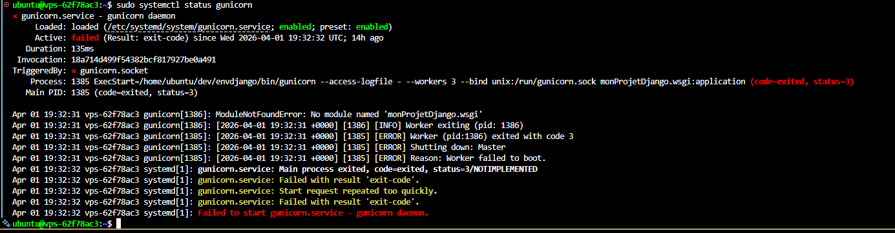
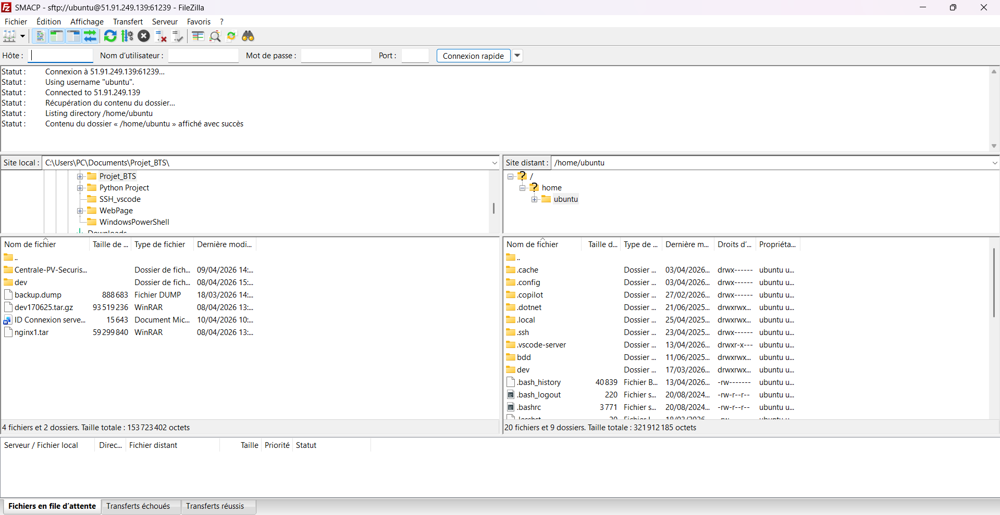
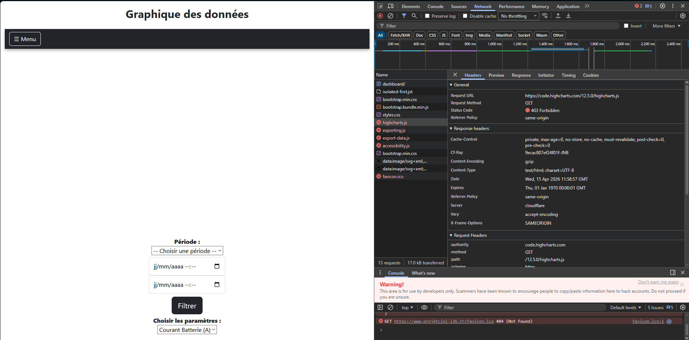
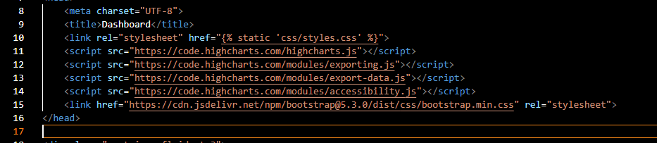
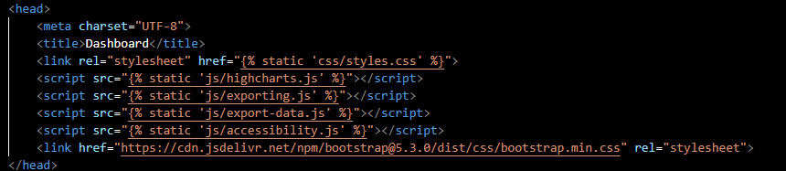
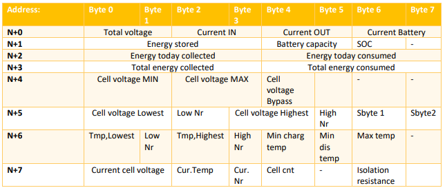
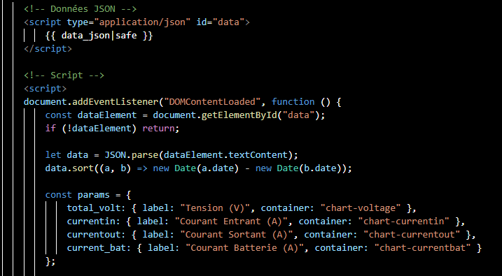

# Documentation e3

## Février

### 16/02/2026 – 18/02/2026
Début du projet SMACP :
- Mise en place du GitHub
- Travail partiel sur la passerelle et le RAK GPS

---

### 25/02/2026
Récupération des identifiants :
- Serveur Django
- Serveur BDD (PostgreSQL)

Mise en place de la connexion via :
- PuTTY
- VSCode

**Avantage VSCode :**
- Interface graphique
- Configuration de plusieurs connexions SSH


---

### 18/03/2026

#### Étape 1 : Accès aux BDD
- Récupération des accès aux différentes bases de données
- Correction de problèmes
- Copie de la BDD PostgreSQL vers une machine de test

---

#### Problème 1 : Accès à PostgreSQL
- Aucun mot de passe pour accéder à la BDD sur le serveur
- Solution : trouvé dans les documents fournis

---

#### Problème 2 : Droits administrateur
- Impossible de créer la copie sur le poste de test
- Cause : pas d’accès admin PostgreSQL

**Solution : modification du fichier :*etc/postgresql/15/main/pg_hba.conf*

> ⚠️ Le "15" correspond à la version de PostgreSQL

---

#### Configuration pg_hba.conf


Dans ce fichier :
- Gestion des connexions PostgreSQL
- Configuration des bases de données
- Accès super utilisateur

Modification :
- Remplacer `md5` par `trust`

**Explication :**
- `md5` : méthode sécurisée avec mot de passe (hachage)
- `trust` : aucune authentification demandée

> ⚠️ ATTENTION :
> Utiliser `trust` uniquement en environnement sécurisé  
> Risque de faille de sécurité sinon

---

#### Problème 3 : Version PostgreSQL

Versions différentes :
- Serveur : 16.9
- Machine de test : 16.8

Commande utilisée :
```bash
pg_restore -U postgres -d django_database_backup ~/backups/backup.dump
```
Erreur : pg_restore: unsupported version (1.15) in file header

Solution = Ajout du host dans la commande de base :
```bash
pg_restore -U postgres -d django_database_backup --host=localhost ~/backups/backup.dump
```
Résultat la base de donnée est bien copié dans le postgresql.

### 27/03/2026 - 08/04/2026 
#### Perte et Récupération de dossier important du Serveur.
Durant la mise en place du Github une mauvaise commande :
``` 
git add . 
``` 
A amener a la perte de dossiers et fichiers important tel que : 
- manage.py
- dossier cert (pour les certifications SSL)
- un fichier index.html
- un fichier wsgi

Le résultat et que le site ne fonctionner plus avec une erreur 502. Cette erreur est du au faite que Gunicorn ne pouvais plus démarrer cause de la disparition du fichier wsgi.



C'est pertes et erreurs ont pu être résolu grâce a la réstauration réaliser sur le OVH (l'hébergeur du serveur)

### 08/04/2026 
#### Copie du Projet Django en local

Après les erreurs réaliser la décision de faire une copie du projet en local et sur un serveur local (plus de détail en bas)

Pour sa nous avons utiliser FileZilla qui est un client FTP qui permet de faire la copie de Fichier et Dossier depuis une connexion distante (Serveur etc...)


*FileZilla*

### 10/04/2026
#### Mise en place en d'un serveur backup django
Pour le serveur django utiliser en local la même version Ubuntu que celle utiliser en production et prise 24.10 et Rufus et utiliser pour créé la clés bootable

### 13/04/2026
#### Récupération des Iptables et des règles mise en place

#### Intégration des données

- Regroupement des données récupéré par l'étudiant E1 et E2

### 15/04/2026 - 16/04/2026 
#### Highcharts en static
Un autre problème rencontrer est que le site charger des liens CDN (Content Delivery Network) Highcharts qui rapidemet présente des limitations, en effet Highcharts peut bloquer les liens si ces derniers présente une utilisations exéssif (par exemple : trop requette envoyé en rechargeant la page web) ou alors une date d'utilisation dépasser.


*Comme vous pouvez le voir si dessus highcharts n'autorise pas la connexion a ses liens.*

Pour régler ce problème nous allons mdofier les liens highcharts qui sont en CDM en les méttant en static en installant les fichiers nécessaire depuis leur site. 

Avant nous utilisions 4 liens CDM highcharts : 

*Si dessous les liens CDM pour highcharts.js, exporting.js, export-data.js, accessibility.js*

```monProjetDjango/GestionExploitant/templates/dashboard.html```


Nous les avons remplacer par des liens qui mène vers des fichiers static :


*Si dessous les liens static pour highcharts.js, exporting.js, export-data.js, accessibility.js*

```monProjetDjango/GestionExploitant/templates/dashboard.html```


### 26/05/2026
#### Modification code HTML, Models.py, views.py
ces modifications servent surtout a rajouter les données de la batterie N+0 N+1 N+2 etc... déjà présente dans les models django et la BDD mais qui n'avait pas étais ajouté auparavant.




*Les différentes donnéees de la batterie (N+0, N+1, N+2 etc...) chaque adresse on leur propre donnée communiqué*

Seule N+0 était déjà présente avec la page grapheDesDonnées j'ai donx récupéré le code base et fais les modification principalement dans la partie script du code afin de l'adapter aux différentes données de la batterie : 

*Si dessous vous avez le script de récupération des donnée de N+0(ainsi que de leur configuration)*

```monProjetDjango/GestionExploitant/templates/visualisation_graphique.html```


