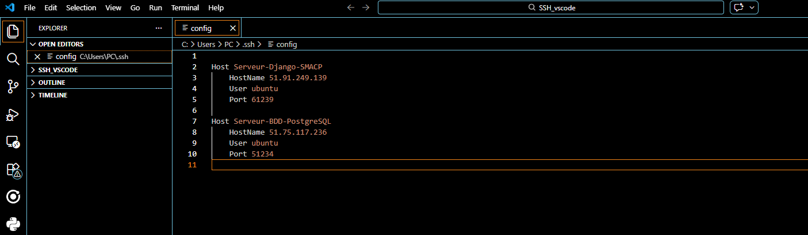
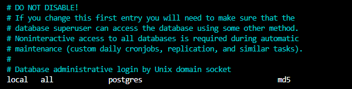

# Documentation e3

## Février

### 16/02/2026 – 18/02/2026
Début du projet SMACP :
- Mise en place du GitHub
- Travail partiel sur la passerelle et le RAK GPS

---

### 25/02/2026
Récupération des identifiants :
- Serveur Django
- Serveur BDD (PostgreSQL)

Mise en place de la connexion via :
- PuTTY
- VSCode

**Avantage VSCode :**
- Interface graphique
- Configuration de plusieurs connexions SSH


---

### 18/03/2026

#### Étape 1 : Accès aux BDD
- Récupération des accès aux différentes bases de données
- Correction de problèmes
- Copie de la BDD PostgreSQL vers une machine de test

---

#### Problème 1 : Accès à PostgreSQL
- Aucun mot de passe pour accéder à la BDD sur le serveur
- Solution : trouvé dans les documents fournis

---

#### Problème 2 : Droits administrateur
- Impossible de créer la copie sur le poste de test
- Cause : pas d’accès admin PostgreSQL

**Solution : modification du fichier :*etc/postgresql/15/main/pg_hba.conf*

> ⚠️ Le "15" correspond à la version de PostgreSQL

---

#### Configuration pg_hba.conf



Dans ce fichier :
- Gestion des connexions PostgreSQL
- Configuration des bases de données
- Accès super utilisateur

Modification :
- Remplacer `md5` par `trust`

**Explication :**
- `md5` : méthode sécurisée avec mot de passe (hachage)
- `trust` : aucune authentification demandée

> ⚠️ ATTENTION :
> Utiliser `trust` uniquement en environnement sécurisé  
> Risque de faille de sécurité sinon

---

#### Problème 3 : Version PostgreSQL

Versions différentes :
- Serveur : 16.9
- Machine de test : 16.8

Commande utilisée :
```bash
pg_restore -U postgres -d django_database_backup ~/backups/backup.dump
```
Erreur : pg_restore: unsupported version (1.15) in file header

Solution = Ajout du host dans la commande de base :
```bash
pg_restore -U postgres -d django_database_backup --host=localhost ~/backups/backup.dump
```
Résultat la base de donnée est bien copié dans le postgresql.
